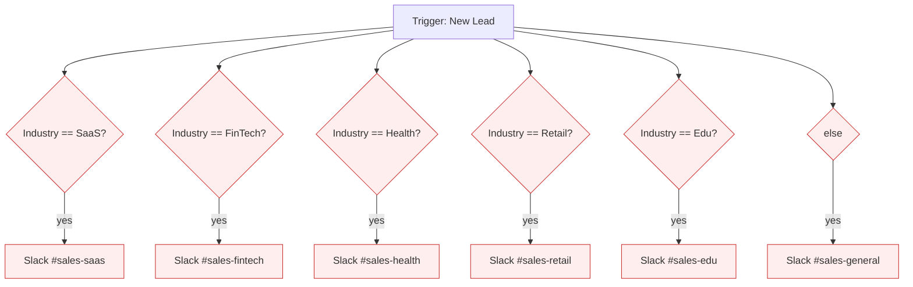
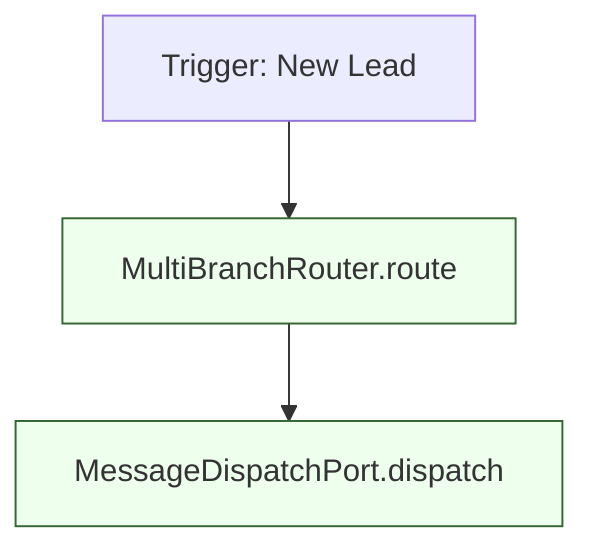
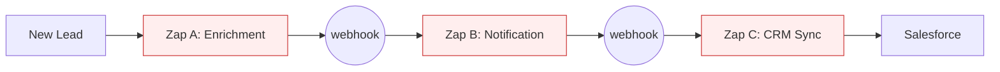
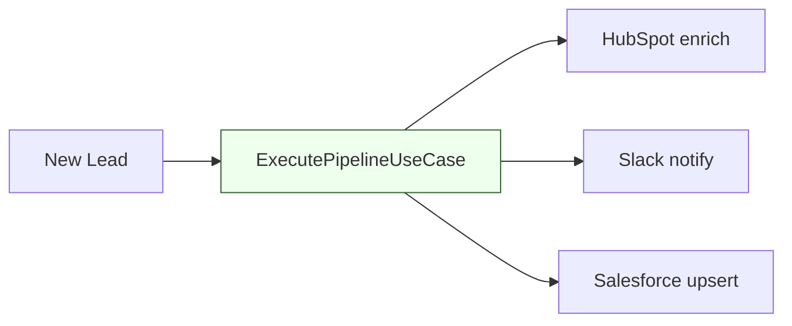
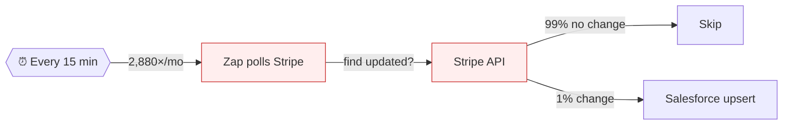
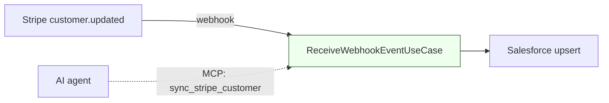
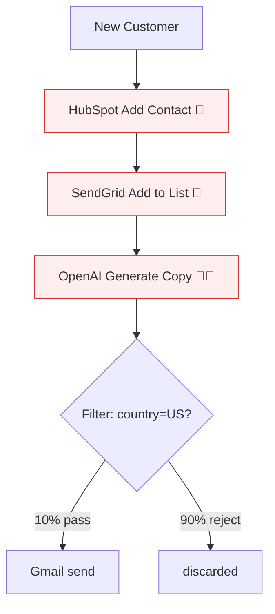
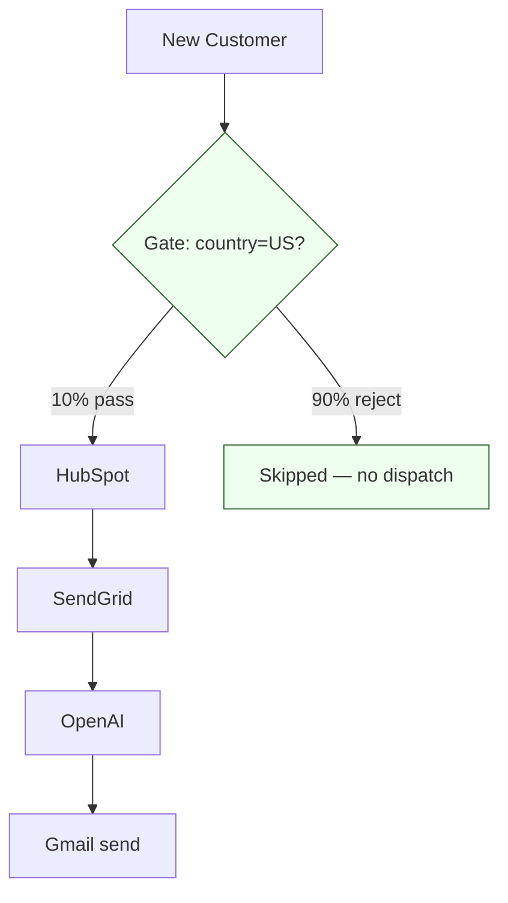
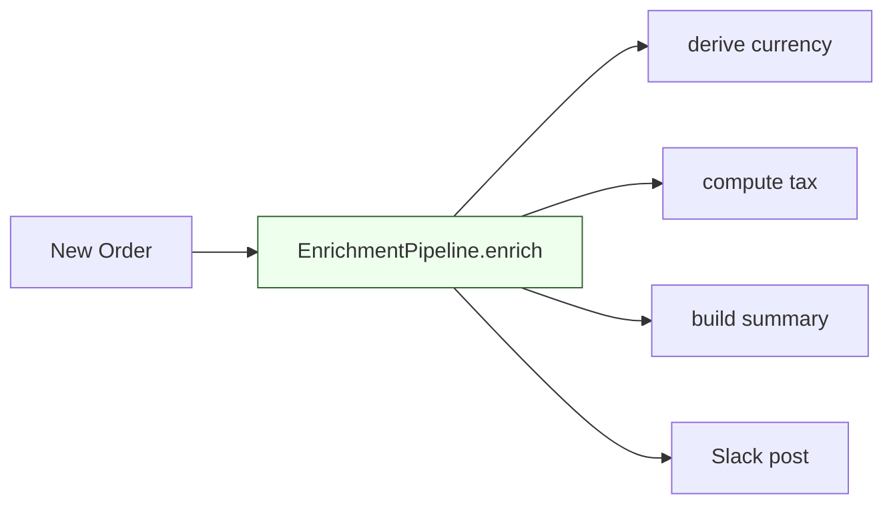
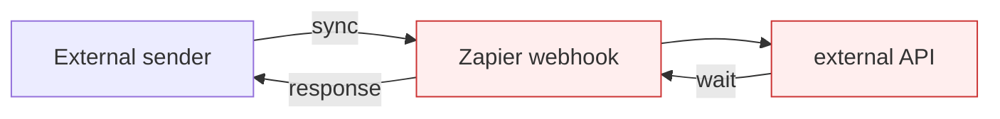

# The Twinface Anti-Pattern Catalog

> Six Zapier shapes that quietly burn your task budget — and the
> Spring/Kotlin primitives that replace them.

This is the long version of the catalog summarized in the
[README](../README.md). For each pattern: the symptom, the cost
arithmetic, a before/after diagram, the Twinface domain primitive
that replaces it, and links to the source.

Every primitive in this catalog ships in `:domain` (pure Kotlin, no
external dependencies) with a corresponding `:application` use case
when the pattern requires I/O. Architecture rules are enforced by
ArchUnit at CI time — see
[`DomainArchitectureTest`](../domain/src/test/kotlin/com/nova/zapierreplacement/domain/DomainArchitectureTest.kt)
and
[`ApplicationArchitectureTest`](../application/src/test/kotlin/com/nova/zapierreplacement/application/ApplicationArchitectureTest.kt).

---

## A1 — Multi-branch parallel paths

### Symptom

A single trigger fans out to 6+ Paths, each running 99% identical
logic with one variable swapped. Common shapes: per-industry routing,
per-region routing, per-language routing.

### Cost

Zapier evaluates *every* path on every trigger, even when only one
matches. Each step on a non-matching path still counts:

```
Tasks per event  =  N branches × steps per branch
Example          =  6 branches × 2 steps  =  12 tasks/event
At 1,000 events/mo: 12,000 tasks/mo

After migration: 1 dispatch per event (or 2 if you count the routing
decision separately)
Saving: ~83-92% on that workflow
```

### Before



12 tasks/event · 6 paths evaluated regardless of match.

### After



1 routing decision · matched branches dispatched in parallel via coroutines · failures isolated per branch.

### Twinface primitive

| Layer | Type | Source |
|---|---|---|
| Domain | [`MultiBranchRouter`](../domain/src/main/kotlin/com/nova/zapierreplacement/domain/workflow/MultiBranchRouter.kt) | Routes one event to all matching `RoutingRule`s |
| Domain | [`RoutingRule`](../domain/src/main/kotlin/com/nova/zapierreplacement/domain/workflow/RoutingRule.kt) | id, branchName, targetChannel, matcher predicate |
| Application | [`RouteEventUseCase`](../application/src/main/kotlin/com/nova/zapierreplacement/application/workflow/RouteEventUseCase.kt) | Fan-out dispatch via `supervisorScope` so a failed branch does not cancel siblings |

```kotlin
val router = MultiBranchRouter(
    listOf(
        RoutingRule("saas", "#sales-saas", NotificationChannel.SLACK) {
            it.payload["industry"] == "SaaS"
        },
        RoutingRule("fintech", "#sales-fintech", NotificationChannel.SLACK) {
            it.payload["industry"] == "FinTech"
        },
        // ...
    ),
)

val useCase = RouteEventUseCase(
    router = router,
    dispatcher = slackAdapter,
    messageBuilder = { branch, event -> DispatchMessage(branch.branchName, event.toMessage()) },
)

useCase.execute(event)  // dispatches matched branches in parallel
```

---

## A2 — Cascading Zaps (Zap-in-Zap)

### Symptom

Zap A finishes by triggering Zap B, which triggers Zap C. Each hop is
a separate Zap with its own task billing, and Zapier's polling delay
stacks across hops.

### Cost

```
Zap A: 2 tasks (trigger + enrich + webhook out)  ≈ 3
Zap B: 2 tasks (trigger + notify + webhook out)  ≈ 3
Zap C: 2 tasks (trigger + upsert)                ≈ 2
Total per event: ~8 tasks
At 500 events/mo: 4,000 tasks/mo
After migration: 1 atomic call, only external API calls count.
Saving: ~60-75% + 5-15 minute polling latency removed.
```

### Before



### After



3 external API calls, 1 atomic transaction, no polling delay between steps. Failures stop the chain at the failed step (same fail-fast semantics as the original Zap chain).

### Twinface primitive

| Layer | Type | Source |
|---|---|---|
| Domain | [`SequentialPipeline`](../domain/src/main/kotlin/com/nova/zapierreplacement/domain/workflow/SequentialPipeline.kt) | Ordered list of steps with unique IDs |
| Domain | [`PipelineStep`](../domain/src/main/kotlin/com/nova/zapierreplacement/domain/workflow/PipelineStep.kt) | id, name, targetChannel |
| Application | [`ExecutePipelineUseCase`](../application/src/main/kotlin/com/nova/zapierreplacement/application/workflow/ExecutePipelineUseCase.kt) | Sequential dispatch, fail-fast, partial trail |

---

## A3 — Polling instead of webhook

### Symptom

A Zap that runs every 5 / 15 / 60 minutes asking "did X change in
Stripe / GitHub / Slack?" when the source system natively supports
webhooks.

### Cost

```
15-minute polling: 96 polls/day × 30 days = 2,880 trigger tasks/mo
                   (best case — each poll is at minimum 1 task)
With webhook (push): 0 polling tasks. Fires only on real events.
Real events/mo: ~50-200 typical SMB.
Saving: 90-99% of polling tasks. Latency drops from 0-15 min to <1 sec.
```

### Before



### After



Push from source · <1 sec latency · same backend exposed as MCP tool for agents. **Idempotency is part of the contract** — the same delivery retried by the provider short-circuits as `Duplicate`, not double-dispatched.

### Twinface primitive

| Layer | Type | Source |
|---|---|---|
| Domain | [`WebhookEvent`](../domain/src/main/kotlin/com/nova/zapierreplacement/domain/workflow/WebhookEvent.kt) | source + eventType + body + arrival time |
| Domain | [`WebhookSubscription`](../domain/src/main/kotlin/com/nova/zapierreplacement/domain/workflow/WebhookSubscription.kt) | source/eventType/matcher + dedup key extractor |
| Domain | [`WebhookEventReceiver`](../domain/src/main/kotlin/com/nova/zapierreplacement/domain/workflow/WebhookEventReceiver.kt) | First-match routing |
| Application | [`IdempotencyStorePort`](../application/src/main/kotlin/com/nova/zapierreplacement/application/ports/IdempotencyStorePort.kt) | Atomic `markSeenIfAbsent(key) -> Boolean` |
| Application | [`ReceiveWebhookEventUseCase`](../application/src/main/kotlin/com/nova/zapierreplacement/application/workflow/ReceiveWebhookEventUseCase.kt) | Receive → dedup → dispatch |

The `IdempotencyStorePort` contract is **atomic** by signature (a
single `markSeenIfAbsent(key) -> Boolean` rather than a separate
`contains` + `add`) so infrastructure implementers cannot accidentally
ship a non-atomic adapter under concurrent retried deliveries.

---

## A4 — Filter step at the wrong place

### Symptom

A Zap fires, runs 3 expensive API calls (HubSpot lookup, SendGrid
add-to-list, OpenAI generate-copy), *then* a Filter step decides
"actually, skip — country is not US." The 90% of events that fail the
filter still pay for HubSpot, SendGrid, and OpenAI.

### Cost

```
Without filter optimization (filter at end):
  Every event: 4-5 tasks regardless of filter outcome.
  90% of events also burn $0.002 OpenAI per skipped event.
  At 1,000 events/mo, 10% pass: $1.80/mo wasted on OpenAI alone,
  plus 4,000 wasted Zapier tasks.

With filter at step 1:
  Filtered events: 1 task.
  Passed events: 4-5 tasks.
  Saving: ~80% of tasks for typical 90/10 reject ratio.
```

### Before



### After



**Type-level enforcement**: the gate is a separate, mandatory field on
`GuardedPipeline`. There is no way to construct a pipeline that runs
an expensive step before the filter — exactly the safety property the
Zapier shape lacks.

### Twinface primitive

| Layer | Type | Source |
|---|---|---|
| Domain | [`GuardCondition`](../domain/src/main/kotlin/com/nova/zapierreplacement/domain/workflow/GuardCondition.kt) | id, description, predicate |
| Domain | [`GuardedPipeline`](../domain/src/main/kotlin/com/nova/zapierreplacement/domain/workflow/GuardedPipeline.kt) | Mandatory gate + step list |
| Domain | [`GuardedPipelineExecution`](../domain/src/main/kotlin/com/nova/zapierreplacement/domain/workflow/GuardedPipelineExecution.kt) | Sealed: `Skipped` vs `Executed` |
| Application | [`ExecuteGuardedPipelineUseCase`](../application/src/main/kotlin/com/nova/zapierreplacement/application/workflow/ExecuteGuardedPipelineUseCase.kt) | Gate first, then sequential dispatch |

```kotlin
val gate = GuardCondition(id = "us-only", description = "country == US") {
    it.payload["country"] == "US"
}

val pipeline = GuardedPipeline(
    gate = gate,
    steps = listOf(
        PipelineStep("hubspot", "HubSpot Add Contact", NotificationChannel.WEBHOOK),
        PipelineStep("sendgrid", "SendGrid Add to List", NotificationChannel.WEBHOOK),
        PipelineStep("openai", "OpenAI Generate Welcome", NotificationChannel.WEBHOOK),
        PipelineStep("gmail", "Gmail Send", NotificationChannel.EMAIL),
    ),
)

useCase.execute(event)  // returns Skipped(...) for non-US, Executed(...) for US
```

---

## A5 — Code-by-Zapier heavy lifting

### Symptom

A Zap step running Python or JavaScript inline, doing data
transformation, lookups, or formatting on every event. Common
shapes: "compute total from line items," "format phone number,"
"build a Slack message body."

### Cost

- Each invocation is a billable task.
- Free plan: 1-second wall-clock execution limit. Paid: 10 seconds.
  Enrichments often hit these limits as data shapes grow.
- The code is **untestable** in isolation — you can only run it through
  Zapier with a real trigger.
- The code is **unshareable** across Zaps — to reuse, you copy-paste.

### Before

A Zap with three "Code by Zapier" steps stacked:

```
Trigger: New Order
  Code A: derive currency from country
  Code B: compute tax from price + currency
  Code C: build line item summary for Slack
  Slack: post #orders
```

### After

The transformations live as named pure functions in your backend,
composed in declaration order:



Zero per-run cost · zero timeout · full unit-test reach · trivially
shareable across workflows.

### Twinface primitive

| Layer | Type | Source |
|---|---|---|
| Domain | [`EventEnrichment`](../domain/src/main/kotlin/com/nova/zapierreplacement/domain/workflow/EventEnrichment.kt) | id, name, derive: (Map) -> Map |
| Domain | [`EnrichmentPipeline`](../domain/src/main/kotlin/com/nova/zapierreplacement/domain/workflow/EnrichmentPipeline.kt) | Composes enrichments, later-wins on conflict |
| Domain | [`EnrichedEvent`](../domain/src/main/kotlin/com/nova/zapierreplacement/domain/workflow/EnrichedEvent.kt) | Result with `applied` audit trail |

```kotlin
val pipeline = EnrichmentPipeline(
    listOf(
        EventEnrichment("currency", "country→currency") { p ->
            mapOf("currency" to currencyForCountry(p["country"] as String))
        },
        EventEnrichment("tax", "price+currency→tax") { p ->
            val price = p["price"] as Int
            mapOf("tax" to taxFor(price, p["currency"] as String))
        },
        EventEnrichment("summary", "build slack body") { p ->
            mapOf("slack_body" to formatSummary(p))
        },
    ),
)

val enriched = pipeline.enrich(event)
slack.post(enriched.event.payload["slack_body"] as String)
```

**Design note**: `EnrichmentPipeline` is domain-only by design — there
is no `EnrichEventUseCase` wrapper. Enrichment is pure transformation
with zero I/O, meant to compose *inside* other use cases (e.g. between
an inbound webhook receipt and a downstream router). Adding a facade
over a facade is exactly the ceremony the project's
[CLAUDE.md](../CLAUDE.md) prohibits.

---

## A6 — Synchronous webhook chains

### Symptom

External sender → your Zapier webhook → external API → wait → respond
to original sender. Sender's HTTP connection is held open for the
worst-case latency of every step downstream.

### Cost

- Every hop is a billable task.
- Latency stacks: a 5-step chain at 2 seconds per step = 10-second
  hold on the original sender's connection.
- Original sender's HTTP timeout becomes a load-bearing constraint
  on your worst-case downstream latency. One slow API call breaks
  the whole chain visibly.

### Before



### After

```mermaid
flowchart LR
  Sender[External sender] -->|sync POST| Acc[AcceptAsyncRequestUseCase]
  Acc -->|persist Accepted| Reg[(AsyncRequestRegistry)]
  Acc -->|"HTTP 202 + requestId"| Sender
  Worker[Background worker] -->|load| Reg
  Worker --> API[external API]
  Worker -->|"compareAndUpdate(Running→Completed)"| Reg
  Sender -.->|GET /status/{id}| Reg
  classDef ok fill:#efe,stroke:#363;
  class Acc,Worker ok
```

Sender unblocked in milliseconds · worker runs on its own clock ·
state machine guarantees only legal transitions ·
[`compareAndUpdate`](../application/src/main/kotlin/com/nova/zapierreplacement/application/ports/AsyncRequestRegistryPort.kt)
is **atomic by signature** so concurrent workers cannot clobber each
other's transitions.

### Twinface primitive

| Layer | Type | Source |
|---|---|---|
| Domain | [`AsyncRequest`](../domain/src/main/kotlin/com/nova/zapierreplacement/domain/workflow/AsyncRequest.kt) | id + acceptedAt + payload |
| Domain | [`AsyncRequestState`](../domain/src/main/kotlin/com/nova/zapierreplacement/domain/workflow/AsyncRequestState.kt) | Sealed: Accepted / Running / Completed / Failed |
| Domain | [`AsyncRequestStateMachine`](../domain/src/main/kotlin/com/nova/zapierreplacement/domain/workflow/AsyncRequestStateMachine.kt) | Pure transitions; rejected moves throw |
| Application | [`AsyncRequestRegistryPort`](../application/src/main/kotlin/com/nova/zapierreplacement/application/ports/AsyncRequestRegistryPort.kt) | persistAccepted + load + compareAndUpdate |
| Application | [`AcceptAsyncRequestUseCase`](../application/src/main/kotlin/com/nova/zapierreplacement/application/workflow/AcceptAsyncRequestUseCase.kt) | The HTTP-202 path |

```kotlin
// API layer (Spring controller, illustrative — not in repo yet):
@PostMapping("/async/incoming")
suspend fun accept(@RequestBody body: Map<String, Any?>): ResponseEntity<Map<String, String>> {
    val request = acceptAsyncRequestUseCase.execute(payload = body)
    return ResponseEntity.accepted().body(mapOf("requestId" to request.id))
}

// Worker (also illustrative — picks Accepted off a queue):
suspend fun processOne(state: AsyncRequestState.Accepted) {
    val running = AsyncRequestStateMachine.markRunning(state, clock())
    if (!registry.compareAndUpdate(state, running)) return  // someone else got it

    val result = try {
        externalApi.call(state.request.payload)
    } catch (e: Exception) {
        val failed = AsyncRequestStateMachine.markFailed(running, clock(), e.message ?: "unknown")
        registry.compareAndUpdate(running, failed)
        return
    }

    val completed = AsyncRequestStateMachine.markCompleted(running, clock(), result)
    registry.compareAndUpdate(running, completed)
}
```

---

## How the patterns compose

The patterns are designed to work together. Two examples:

**Webhook → enrich → guard → route**:

```kotlin
val match = webhookReceiver.receive(incoming)
val subscription = match.matched ?: return  // no subscription, ignore
if (!idempotencyStore.markSeenIfAbsent(match.dedupKey!!)) return  // duplicate

val enriched = enrichmentPipeline.enrich(toWorkflowEvent(incoming))
val guardResult = executeGuardedPipelineUseCase.execute(enriched.event)
// ...
```

**Async accept → enrich → fan-out**:

```kotlin
// At inbound:
val request = acceptAsyncRequestUseCase.execute(payload = body)
return Accepted(request.id)

// In the worker:
val event = WorkflowEvent(state.request.id, "async.work", state.request.payload)
val enriched = enrichmentPipeline.enrich(event)
val routeResult = routeEventUseCase.execute(enriched.event)
```

Each primitive owns one shape of failure. Combine them with regular
Kotlin function composition; there is no "Twinface DSL" to learn.

---

## Where to read next

- [`README.md`](../README.md) — project overview + status
- [`CONTRIBUTING.md`](../CONTRIBUTING.md) — the five-phase review-loop workflow
- Source files linked in each pattern's table above

---

*This catalog grows as new Zapier shapes are documented. Found one
that isn't here? [Open an issue](https://github.com/itstimi-XD/zapier-replacement-mcp/issues/new)
with a before-diagram and we'll add the Twinface primitive that
replaces it.*
